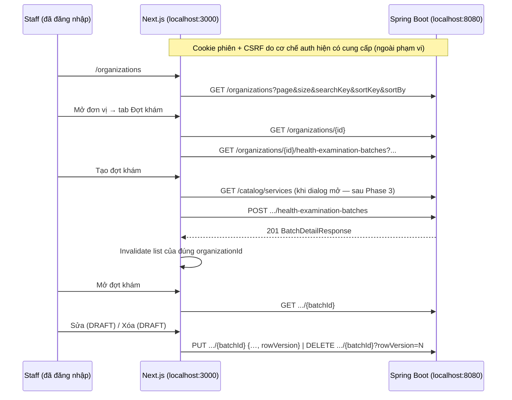

# Kế hoạch nối FE ↔ BE và hoàn thiện luồng khám đoàn

**Ngày:** 2026-10-06 · **Trạng thái:** đề xuất, chưa triển khai. Tài liệu chỉ khảo sát source/docs của hai checkout (kể cả thay đổi chưa commit); chưa build, chưa chạy test, chưa chạy backend thật.

**Mục tiêu:** Staff đã đăng nhập đi trọn chuỗi **Đơn vị (CRUD) → Đợt khám (list/tạo/xem/sửa/xóa)** trên backend thật, không dùng fixture, không gọi endpoint không tồn tại.

**Ngoài phạm vi — không động tới authentication (quyết định của chủ dự án, 2026-10-06):**

- FE: toàn bộ `src/modules/auth/**`, `src/shared/api/http-client.ts`, khối lấy CSRF trong `src/shared/api/api-client.ts`, xử lý 401/phiên trong `src/providers/query-provider.tsx`, `AuthBoundary`/`AuthSessionSync`, `src/app/auth/**`, `app-shell` phần session.
- BE: module `identity`, `AuthSecurityConfiguration`, `AuthInfrastructureConfiguration`, cookie/CSRF/CORS/session, RBAC.
- Plan **dùng** cơ chế đăng nhập/CSRF hiện có như điều kiện tiên quyết, không sửa, không viết thêm test cho chúng. Vấn đề auth phát hiện khi khảo sát chỉ được ghi nhận (mục 1, A1) để người phụ trách auth xử lý riêng.

**Quan hệ với plan cũ:** Kế thừa [2026-10-05-fe-backend-clean-slate.md](2026-10-05-fe-backend-clean-slate.md). Task 0A/3A (thuật ngữ, gỡ import, production→test) đã xử lý theo [cleanup inventory](../../maintenance/frontend-cleanup-inventory.md). Plan này thay Task 2, 3, 4, 7 của plan cũ vì backend đã có thêm batch get/update/delete ngày 2026-10-06. Task 1 (transport/CSRF) của plan cũ **không** thuộc plan này.

**Nguồn chuẩn:** [API inventory BE](../../../../Ngoc_Khanh_Clinic_DX_Springboot/docs/api/clean-slate-migration.md), [domain workflows](../../../../Ngoc_Khanh_Clinic_DX_Springboot/docs/architecture/03-domain-and-workflows.md), [API/security](../../../../Ngoc_Khanh_Clinic_DX_Springboot/docs/architecture/05-api-and-security.md), [PROJECT_RULES FE](../../../PROJECT_RULES.md). Controller/DTO trong source là chuẩn cuối cùng; plan không tạo contract.

---

## 1. Hiện trạng theo luồng

| Luồng | Backend (handler) | Frontend hiện tại | Kết luận |
|---|---|---|---|
| Đăng nhập / CSRF / phiên | `/api/v1/auth/*` | `modules/auth`, `apiClient` tự gắn CSRF cho POST/PUT/DELETE | **Ngoài phạm vi**, dùng nguyên trạng. |
| Đơn vị list/get/create/update/deactivate | Đủ 5 route | `modules/organizations/api` đúng DTO, có `rowVersion` | Đã nối ở mức code; chưa nghiệm thu trên BE thật, UX 409 chưa rõ. |
| Đợt khám — list | `GET .../health-examination-batches` | `fetchHealthExaminationBatchesByOrganization` có, nhưng tab `OrganizationHealthExaminationBatchesTab` là **stub**; `HealthExaminationBatchTable/Toolbar` không được mount | Chưa nối UI. |
| Đợt khám — create | `POST ...` (`examinationDates`, `negotiatedPrice`) | Transport sai (`startDate/endDate/reason/payerType/negotiatedUnitPrice`); dialog không được mount; catalog `unavailable` | Chưa nối; bị chặn bởi catalog (G3). |
| Đợt khám — get | `GET .../{batchId}` (BE mới) | Trang chi tiết là **stub**; schema detail sai (`serviceName`, `currency`, `masterTemplateVersionId`…) | Chưa nối. |
| Đợt khám — update | `PUT .../{batchId}` (DRAFT, `rowVersion`) | Chưa có API/UI | Chưa nối. |
| Đợt khám — delete | `DELETE .../{batchId}?rowVersion=N` (soft, DRAFT, chưa có Participant) | Chưa có API/UI | Chưa nối. |
| Danh mục dịch vụ | **Không có HTTP**; chỉ `ServiceCatalogQuery.findByIds` nội bộ | `fetchClinicalServiceCatalog` → unavailable | **Blocker** cho create/update và hiển thị tên dịch vụ. |
| Người khám, chi tiết khám, báo cáo, xuất file | Không có handler | `ParticipantsTab` vẫn gọi `.../participant`; matrix/report/export → unavailable | Giữ trạng thái “chưa hỗ trợ”, chặn request. |
| Lịch hẹn, tiếp đón, bác sĩ, thu ngân, bệnh nhân | Không có handler | UI + API unavailable | Ngoài phạm vi; roadmap. |

### Khoảng trống trong phạm vi

| ID | Mức | Bằng chứng | Hướng xử lý |
|---|---|---|---|
| G2 | Cao | BE trả message tiếng Anh (“Business rule could not be completed”, “Invalid request”…); `apiClient` hiển thị nguyên `payload.message`. `ApiResponse.code` = HTTP status, không có mã lỗi nghiệp vụ → 409 không phân biệt được stale version / trùng mã / vi phạm quy tắc. | Phase 1: map theo status sang tiếng Việt ở nhánh đọc lỗi của `apiClient`. Đề xuất (cần duyệt) BE bổ sung `errorCode`. |
| G3 | Blocker | Không có endpoint catalog; `BatchDetailResponse.services` chỉ có `serviceId` (không tên/mã). | Phase 3: BE mở `GET /api/v1/catalog/services` — **cần chủ dự án duyệt contract** (AGENTS BE rule 10). |
| G4 | Cao | Profile `local` trỏ Flyway `classpath:db/local` nhưng `src/main/resources/db/local` không tồn tại (chỉ có trong test). DB local không có department/service. | Phase 0: seed danh mục cho local. Tài khoản staff dùng quy trình có sẵn `scripts/auth/provision-staff.sql`, không đổi code identity. |
| G5 | Trung bình | `BatchSummaryResponse` không có `rowVersion`, site, số người khám. | Chỉ cho xóa trong trang chi tiết; hoặc BE thêm `rowVersion` vào summary (chủ dự án quyết). |
| G6 | Trung bình | FE `HEALTH_EXAMINATION_BATCH_STATUSES` còn `IN_PROGRESS, RESULT_PROCESSING, CANCELED, DELETED`. | Phase 4: chỉ `DRAFT/READY/FINALIZED/CLOSED`. |
| G7 | Trung bình | `organization-filters.tsx` còn lọc `IN_PROGRESS/COMPLETED`; BE list không có filter trạng thái (chỉ ACTIVE). | Phase 2: bỏ filter không có contract. |
| G8 | Thấp | Thư mục `e2e/` chưa có; `playwright.config.ts` đã cấu hình project `chromium` và `backend`. | Phase 8. |

### Ghi nhận ngoài phạm vi (bàn giao cho người phụ trách auth, plan này không sửa)

| ID | Bằng chứng | Ảnh hưởng tới plan |
|---|---|---|
| A1 | **Đã xử lý 2026-10-06** bởi [ADR-0007](../../adr/0007-session-login-backend-adr-0014.md): FE theo `UserPrincipal` của BE `accesscontrol`, bỏ CSRF, BE thêm CORS. Mô tả ban đầu: BE `UserSessionResponse` trả `accountId, staffMemberId, accountType, roleAssignments[{roleId, roleCode, permissions, grantedBy, grantedAt}]`; FE `session.schema.ts` đòi `userId, staffId, principalType, assignmentId, departmentId, roomId, validFrom, validTo`. Nếu đúng như source hiện tại, login/me trên BE thật sẽ báo “Phản hồi máy chủ không hợp lệ”. | Nghiệm thu UI trên BE thật (Phase 2, 4–8) **phụ thuộc** A1 được xử lý ở nhánh auth. Trong lúc chờ: phát triển bằng test Vitest/mock và kiểm API bằng curl/Playwright `request` (gọi BE trực tiếp, không qua parse của FE). |
| A2 | `mock-created-by` thừa trong `application-local.yaml`; chưa chặn tổ hợp profile prod+local ([BE follow-ups](../../../../Ngoc_Khanh_Clinic_DX_Springboot/docs/maintenance/code-follow-ups.md)). | Không chặn local integration; chặn production. |

---

## 2. Nguyên tắc áp dụng cho mọi phase

- Luồng dữ liệu: `page → hook (Query/Mutation) → module api (Zod parse + map) → shared apiClient → BE`. Transport DTO bám đúng record Java; view model chỉ map, không chế trường.
- Không thêm endpoint/DTO/trạng thái FE khi BE chưa có; tính năng thiếu contract hiển thị “chưa hỗ trợ” và **không gửi request**.
- Không sửa file thuộc danh sách “ngoài phạm vi” ở đầu tài liệu. Nếu một phase cần thay đổi ở đó, dừng và báo lại thay vì sửa.
- Ngày `LocalDate` = `YYYY-MM-DD`; timestamp `Instant` UTC; format chỉ ở presentation. Tiền `BigDecimal` nhận dạng number, gửi number ≤ 12 chữ số nguyên, 2 chữ số thập phân.
- Mọi write có `rowVersion` thì giữ version từ response gần nhất; 409 giữ nguyên form, đưa nút “Tải lại”, không tự gửi lại.
- Không retry mutation và 4xx (đã có trong `shouldRetryQuery`, giữ nguyên).
- Mỗi phase có test Vitest trước khi sửa (đỏ → xanh) và checks `pnpm lint/typecheck/test/check:terminology`; phase đụng BE chạy `./mvnw verify`.

---

## 3. Luồng mục tiêu



Trạng thái UI của mỗi màn: loading · empty · error (mạng/timeout) · 403 · 404 · 409 · unavailable. (401/hết phiên do lớp auth hiện có xử lý.)

---

## 4. Các phase triển khai

### Phase 0 — Môi trường local chạy được hai đầu

**Repo:** BE (dữ liệu local) + README FE. **Không** đổi code/cấu hình identity.

- [ ] `docker compose up postgres redis`; BE chạy profile `local` với biến môi trường auth đang dùng (`NKC_AUTH_JWT_KEY`, origin `http://localhost:3000`) — chỉ cấu hình môi trường, không sửa code.
- [ ] G4 — dữ liệu danh mục cho local (chủ dự án chọn):
  - (a) Thêm `src/main/resources/db/local/R__local_catalog_seed.sql`: 1 department, vài `services` ACTIVE có `unit_price` và `service_type` hợp lệ. Không seed account/role.
  - (b) Hướng dẫn chạy SQL insert danh mục bằng tay.
- [ ] Tài khoản staff + role: theo quy trình operator có sẵn (`scripts/auth/HashStaffPassword.java`, `scripts/auth/provision-staff.sql`). Không commit mật khẩu.
- [ ] Smoke bằng curl (dùng cookie phiên có được từ login hiện có): `GET /organizations`, `POST /organizations`, `GET .../health-examination-batches` trả 2xx.
- [ ] FE: `.env.local` có `NEXT_PUBLIC_API_BASE_URL=http://localhost:8080`; ghi biến E2E (`E2E_STAFF_USERNAME/PASSWORD`) vào README, không commit giá trị.

**Gate:** curl gọi được business endpoints; ghi lại lệnh và kết quả.

### Phase 1 — Thông điệp lỗi nghiệp vụ (G2)

**Files:** chỉ nhánh xử lý response lỗi trong `src/shared/api/api-client.ts` + `api-client.test.ts`. **Không** sửa khối lấy CSRF, `http-client.ts`, `query-provider.tsx`.

- [ ] `ApiClientError` thêm `serverMessage` (thô, chỉ debug, không render). `message` hiển thị lấy theo status: 400 “Thông tin không hợp lệ. Vui lòng kiểm tra lại.”, 403 “Không được phép thực hiện thao tác này.”, 404 “Không tìm thấy hoặc đã bị xóa/ngừng hoạt động.”, 409 “Dữ liệu đã thay đổi hoặc không thỏa quy tắc nghiệp vụ. Vui lòng tải lại.”, 5xx “Máy chủ gặp lỗi. Vui lòng thử lại sau.”. Status 401/429 giữ hành vi hiện tại.
- [ ] Cho phép `apiClient.post/put/delete` nhận thêm `options` (`signal`) mà không phá caller cũ và không thay đổi cách gắn CSRF.
- [ ] (Đề xuất BE, cần duyệt) thêm `errorCode` ổn định vào `ApiResponse` lỗi của module healthexamination: `STALE_VERSION`, `DUPLICATE_TAX_CODE`, `DUPLICATE_BATCH_CODE`, `DUPLICATE_SERVICE_CODE`, `BATCH_NOT_DRAFT`, `BATCH_HAS_PARTICIPANTS`, `ORGANIZATION_INACTIVE`, `SERVICE_INACTIVE`. Khi có, FE map thông điệp cụ thể; khi chưa có, dùng thông điệp 409 chung.

**Gate:** không còn chuỗi tiếng Anh của BE lộ ra UI nghiệp vụ; test status → message; test auth hiện có vẫn xanh, không sửa.

### Phase 2 — Đơn vị: nghiệm thu end-to-end

**Files:** `src/modules/organizations/**`.

- [ ] Bỏ filter trạng thái không có contract (G7); list chỉ có `searchKey`, sort `id|code|name`, page/size (URL state, Back/Forward).
- [ ] Debounce ô tìm kiếm 300 ms, `signal` hủy request cũ; key query gồm params đã normalize.
- [ ] Sửa/ngừng hoạt động: 409 giữ form + “Tải lại”; sau deactivate điều hướng `/organizations`, xóa cache detail, invalidate list (không refetch detail vì BE trả 404 cho INACTIVE). Thay `window.confirm` bằng `Dialog` có sẵn.
- [ ] Create page và dialog dùng chung schema (max length theo BE: code 50, name 300, taxCode 50, contact 200, email hợp lệ).

**Gate (BE thật, sau A1):** tạo → tìm → mở → sửa → sửa trùng version ở tab khác (409) → ngừng hoạt động → không còn trong list.

### Phase 3 — Danh mục dịch vụ (BE + FE) (G3)

**Điều kiện:** chủ dự án duyệt contract. Đề xuất tối thiểu:

```
GET /api/v1/catalog/services?searchKey=&page=1&size=100&sortKey=code&sortBy=ASC
→ ApiResponse<PageResponse<{ id, code, name, serviceType, unitPrice, active }>>
```

- [ ] BE (module `catalog`): use case + controller + MyBatis query + test; áp dụng nguyên chính sách truy cập business hiện có (không sửa security config — route mới thuộc `/api/v1/**` nên tự nằm dưới rule đang có). Cập nhật API inventory.
- [ ] Tên dịch vụ trong chi tiết đợt khám (chủ dự án chọn): BE bổ sung `serviceCode/serviceName` vào `BatchDetailResponse.ServiceResponse` qua `ServiceCatalogQuery.findByIds` đã có (gọn cho FE), **hoặc** FE tra catalog theo `serviceId`.
- [ ] FE: `fetchClinicalServiceCatalog` gọi endpoint thật, Zod parse; `useClinicalServices` chỉ `enabled` khi dialog mở.

**Gate:** dialog tạo đợt khám liệt kê dịch vụ thật, giá tham chiếu từ `unitPrice`.

### Phase 4 — Đợt khám: danh sách trong tab đơn vị

**Files:** `components/organization-health-examination-batches-tab.tsx`, `components/batch-list/*`, `types/transport.ts`, `utils/batch-status.ts`, `query-keys.ts`, hooks.

- [ ] Status chỉ 4 giá trị (G6); unknown enum → lỗi parse, không map về DRAFT.
- [ ] Thay stub bằng `Toolbar + Table + DataTablePagination`; URL params riêng cho tab (`bq`, `bpage`, `bsort`); sort `id|batchCode|batchName|startDate|status|createdAt`.
- [ ] Hiển thị khoảng ngày `startDate–endDate` (bounds BE tính), trạng thái, ngày tạo; click hàng → `/organizations/{id}/health-examination-batches/{batchId}`.
- [ ] Nút “Tạo đợt khám”: disabled kèm lý do cho tới khi Phase 3 xong.
- [ ] Query key `healthExaminationKeys.batchList(organizationId, params)`; giữ `meta.requiresAuth` như các query đơn vị (chỉ khai báo, không đổi cơ chế).

**Gate:** list thật từ BE; empty state; trang vượt cuối giữ totals; đổi đơn vị không hiện dữ liệu cũ.

### Phase 5 — Đợt khám: tạo mới (sau Phase 3)

**Files:** `schemas/health-examination-batch.schema.ts`, `types/index.ts`, `types/transport.ts`, `api/index.ts`, `components/batch-form/*`.

- [ ] Transport request đúng BE:
  ```ts
  { batchCode (≤50), batchName (≤300), examinationDates: string[] (≥1, không trùng),
    examinationSiteType: "CLINIC" | "ORGANIZATION_SITE", examinationSiteName, examinationSiteAddress (bắt buộc),
    services: { serviceId: uuid, negotiatedPrice: number }[] (≥1, không trùng) }
  ```
  Xóa `startDate/endDate/reason/payerType/negotiatedUnitPrice` khỏi form, type, schema, test.
- [ ] Form chọn **nhiều ngày rời** (Calendar có sẵn trong `components/ui/calendar.tsx`, chế độ chọn nhiều ngày), hiển thị bounds suy ra; cho phép ngày quá khứ (BE cho phép).
- [ ] Bảng dịch vụ: giá tham chiếu (read-only, từ catalog) và giá thỏa thuận (`MoneyInput`), mặc định = giá tham chiếu.
- [ ] Parse `BatchDetailResponse` mới (xem Phase 6). Sau 201: đóng dialog, thông báo, invalidate `batches(organizationId)`, điều hướng sang chi tiết (GET detail đã có).
- [ ] 404 (đơn vị không tồn tại) / 409 (đơn vị INACTIVE, dịch vụ inactive, trùng `batchCode`) giữ form.

**Gate:** tạo đợt khám thật, xuất hiện trong list, mở được chi tiết.

### Phase 6 — Đợt khám: chi tiết, sửa, xóa

**Files:** `pages/health-examination-batch-detail-page.tsx`, `api/index.ts`, hooks, `components/health-examination-batch-summary-strip.tsx`, `health-examination-batch-tabs.tsx`, `batch-form/*` (tái dùng cho edit).

- [ ] Schema detail đúng BE:
  ```ts
  { id, organizationId, batchCode, batchName, days: {id, examinationDate}[], startDate, endDate,
    examinationSiteType, examinationSiteName, examinationSiteAddress, status, createdBy, createdAt, updatedAt,
    rowVersion, services: {id, serviceId, referencePriceSnapshot, negotiatedPrice, displayOrder, active, rowVersion}[] }
  ```
  Bỏ `reason, payerType, masterTemplateVersionId, finalizedAt, closedAt, serviceName, serviceCode, currency, documentTemplateVersionId` (trừ khi Phase 3 chọn BE trả thêm `serviceCode/serviceName`).
- [ ] API mới: `fetchHealthExaminationBatchById(orgId, batchId, signal)`, `updateHealthExaminationBatch(orgId, batchId, body + rowVersion)`, `deleteHealthExaminationBatch(orgId, batchId, rowVersion)`. Query key detail gồm `organizationId`.
- [ ] Trang chi tiết: header (mã, tên, trạng thái, khoảng ngày, địa điểm), danh sách ngày, bảng dịch vụ theo `displayOrder`.
- [ ] Sửa: chỉ hiện khi `status === "DRAFT"`; dialog tái dùng form create, prefill từ detail; gửi toàn bộ cấu hình + `rowVersion`. 409 (không còn DRAFT, stale, bỏ ngày/dịch vụ đang được tham chiếu) → giữ form + “Tải lại”.
- [ ] Xóa: chỉ khi DRAFT, trong trang chi tiết (G5); xác nhận bằng `Dialog`; gửi `rowVersion` của detail; 204 → về tab Đợt khám, `removeQueries` detail, invalidate list. 409 → “Đợt khám đã có người khám hoặc không còn ở trạng thái nháp.”
- [ ] 404 (đã xóa/không thuộc đơn vị) → trạng thái không tìm thấy + link về đơn vị.

**Gate:** tạo → mở → sửa → sửa lại bằng version cũ (409) → xóa → 404 khi mở lại link.

### Phase 7 — Chặn các tab chưa có contract trong chi tiết đợt khám

- [ ] Tab “Người khám”, “Chi tiết khám”, “Báo cáo” hiển thị “Chưa hỗ trợ” ở cấp page/hook; `useHealthExaminationBatchParticipants` không được gọi (không mount hoặc `enabled: false`). Không có nút retry.
- [ ] Test: mở trang chi tiết không phát sinh request tới `.../participant`, matrix, report, export.
- [ ] Giữ `export-excel.ts` và component tab (roadmap), không xóa domain chỉ vì thiếu API.

### Phase 8 — E2E và nghiệm thu

**Files:** `e2e/organization-flow.backend.spec.ts`, `e2e/batch-flow.backend.spec.ts`, `e2e/unsupported-routes.spec.ts`. Không tạo spec kiểm thử auth.

- [ ] Project `backend`: dùng đăng nhập hiện có làm bước setup (`storageState`), rồi chạy đơn vị CRUD → đợt khám CRUD; mã dữ liệu ngẫu nhiên theo lần chạy; credentials từ biến môi trường; không chạy trên production. Bị chặn nếu A1 chưa xử lý — ghi rõ là skip có lý do, không tính hoàn tất.
- [ ] Project `chromium` (mock bằng `page.route`): 403/404/409/timeout của luồng nghiệp vụ, deep link tab chưa hỗ trợ không gửi request.
- [ ] `pnpm exec playwright test --list` để chắc test được phát hiện; ghi số test đã chạy, không chỉ exit code.
- [ ] Chạy đủ: FE `pnpm lint && pnpm typecheck && pnpm test && pnpm check:terminology && pnpm build && pnpm test:e2e && pnpm test:e2e:backend`; BE `./mvnw verify` (Docker cho Testcontainers).
- [ ] Cập nhật: README FE (Trạng thái tích hợp), `docs/maintenance/code-follow-ups.md`, API inventory BE (nếu Phase 3 thêm route).

---

## 5. Thứ tự và phụ thuộc

| Thứ tự | Phase | Repo | Phụ thuộc | Song song |
|---|---|---|---|---|
| 1 | 0 — Môi trường + seed danh mục | BE | Quyết định G4 | — |
| 2 | 1 — Thông điệp lỗi | FE | — | Phase 3 (BE), 4 |
| 3 | 2 — Đơn vị E2E | FE | 1; nghiệm thu UI cần A1 | Phase 3 |
| 4 | 3 — Catalog | BE → FE | Duyệt contract | Phase 2, 4 |
| 5 | 4 — List đợt khám | FE | 1 | Phase 3 |
| 6 | 6 — Chi tiết/sửa/xóa | FE | 4; tên dịch vụ cần 3 | Phase 5 |
| 7 | 5 — Tạo đợt khám | FE | 3, 4 | Phase 6 |
| 8 | 7 — Chặn tab | FE | 6 | — |
| 9 | 8 — E2E | FE | Tất cả (+ A1 cho project backend) | Viết dần theo phase |

Đề xuất PR: **PR-A** Phase 0 (BE) · **PR-B** Phase 1 · **PR-C** Phase 2 · **PR-D** Phase 3 (BE) · **PR-E** Phase 4+6+7 · **PR-F** Phase 5 · **PR-G** Phase 8 + docs.

## 6. Quyết định cần chủ dự án

1. **G4 dữ liệu danh mục local:** migration `db/local` (a) hay SQL chạy tay (b)?
2. **G3 catalog:** duyệt route/DTO `GET /api/v1/catalog/services`; tên dịch vụ trong batch detail lấy từ BE response hay FE tra catalog?
3. **G2 mã lỗi:** có thêm `errorCode` vào envelope lỗi không?
4. **G5:** chỉ cho xóa đợt khám trong trang chi tiết (mặc định của plan) hay BE thêm `rowVersion` vào danh sách?
5. Chuyển trạng thái đợt khám `DRAFT → READY → FINALIZED → CLOSED`: chưa có use case/endpoint; cần spec trước khi FE làm nút chuyển trạng thái.
6. **A1:** ai xử lý lệch DTO phiên đăng nhập và mốc thời gian, vì nghiệm thu UI trên BE thật phụ thuộc vào đó.

## 7. Roadmap sau plan này (cần BE contract trước)

1. Chuyển trạng thái đợt khám (READY/FINALIZED/CLOSED).
2. Roster Participant thủ công: list/add/edit/cancel, ngày dự kiến thuộc batch, CCCD duy nhất trong batch; **không** khôi phục Excel import.
3. Điểm danh (UNCONFIRMED/ATTENDED/ABSENT) và chuẩn bị lượt khám (liên kết/tạo Patient theo CCCD chính xác).
4. Đối soát dịch vụ thực hiện (PENDING/RECONCILED, giữ giá lịch sử) → báo cáo/xuất file.
5. Hồ sơ khám, in Mẫu 03; sau đó reception/doctor/diagnostics/billing theo plan riêng.

## 8. Định nghĩa hoàn tất

- Đơn vị CRUD và đợt khám list/get/create/update/delete chạy trên backend thật (local profile); E2E `backend` pass với số test thực, hoặc skip có lý do ghi rõ (A1).
- FE không còn DTO/trường/trạng thái cũ của đợt khám; không request tới route không tồn tại; tab chưa hỗ trợ hiển thị đúng trạng thái.
- 403/404/409/timeout có UX riêng, thông điệp tiếng Việt; 409 không làm mất dữ liệu form.
- Không có thay đổi nào trong các file/module auth đã liệt kê ở đầu tài liệu (kiểm bằng `git diff --stat`).
- Checks FE và `./mvnw verify` có kết quả thật; tài liệu inventory/README/follow-ups cập nhật.
